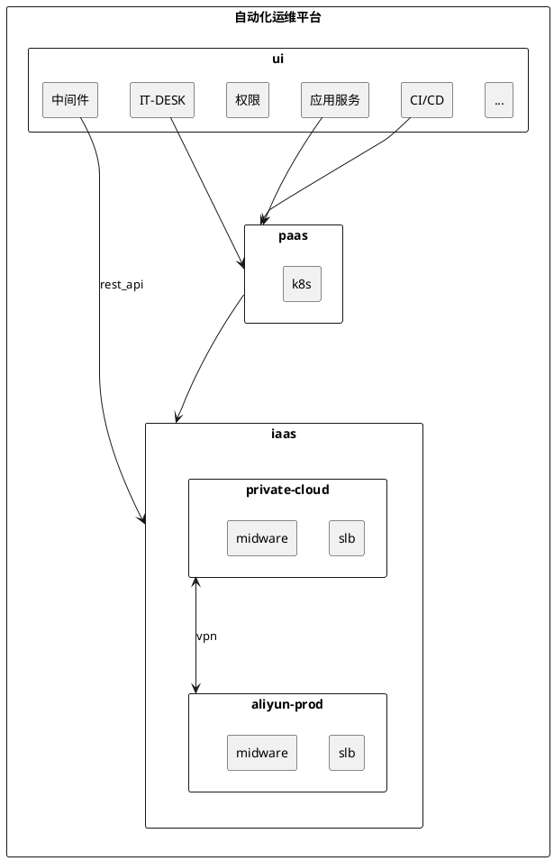

# 自动化运维平台

```plantuml
@startuml

rectangle 自动化运维平台 {


	rectangle ui {
		rectangle  other as "..." {


		}
		rectangle  midware as "中间件" {


		}

		rectangle it  as "IT-DESK" {


		}
		rectangle  perm as "权限" {


		}

		rectangle  app as "应用服务" {


		}

		rectangle  ci_cd as "CI/CD" {


		}

	}

	rectangle paas {


		rectangle  "k8s" {


		}

	}

	rectangle iaas {

		rectangle opennebula as "private-cloud" {
			rectangle   slb_private   as "slb" 
			rectangle   slb_private   as "slb"
			rectangle   midware_private as "midware"

		}

		rectangle aliyun  as "aliyun-prod" {
			rectangle   slb_prod   as "slb"
			rectangle   midware_prod as "midware"

		}
	}
}


paas  --->  iaas


opennebula  <---> aliyun   :vpn

midware ---> iaas  :rest_api

it ---> paas

app  ---> paas

ci_cd  ---> paas

@enduml


```