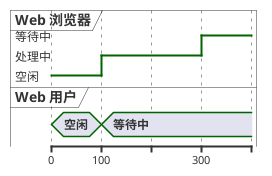
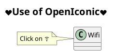
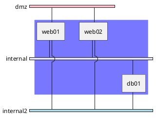

## 网络架构

- [参考](https://www.jianshu.com/p/ee783f13d0a7)
- 学习了解,运维可能出现的问题。

`IDC的规划设计和其他网络不一样的地方在于IDC对网络通信模式有着很高的灵活性要求。在同一个IDC内很有可能存在需要直接设置外网IP的服务器、只有内网但需要访问外网的服务器、用F5带集群业务、用RD模式的LVS带业务。所以IDC对灵活性的要求非常高。对于互联网企业，其业务变化的速度相当的高，可能一个月之内要扩展1000台服务器也不一定，也有可能一年也加不了服务器。所以考虑到预算问题，IDC的设计需要一个高度可扩展、高度灵活，同时保证性能、可用性。`

## 直接设置外网IP的通信模型

