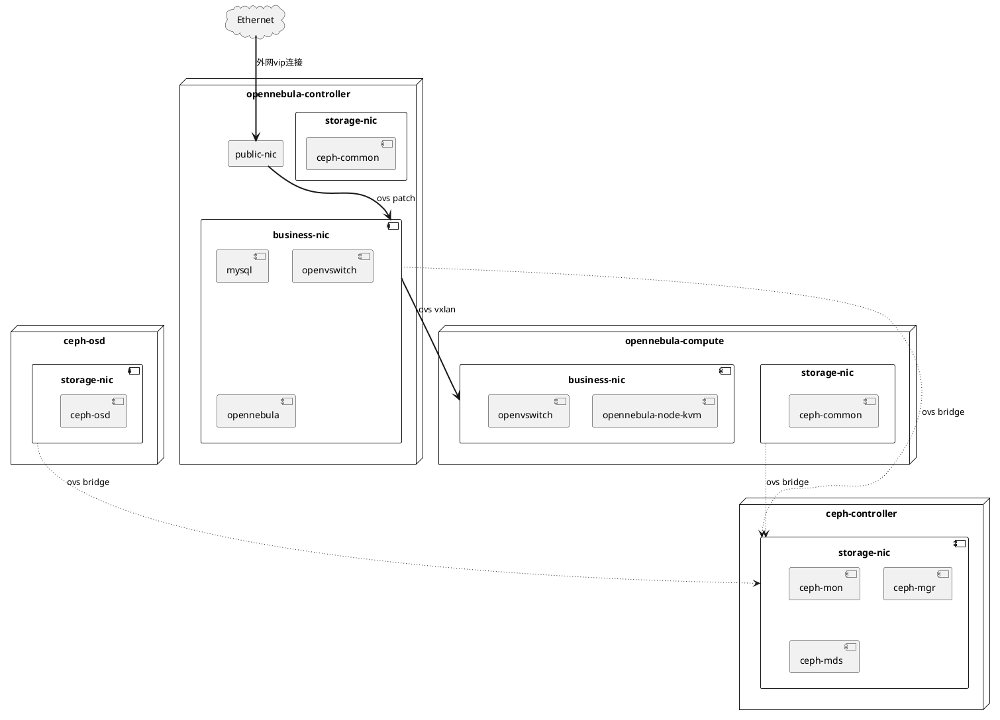

#  Opennebula 说明

1. 基础架构

opennebula kvm  ovs  ceph部署图

```plantuml
@startuml

cloud Ethernet{

}

node "opennebula-controller" {
 rectangle NIC1  as "public-nic"

 rectangle NIC3  as "storage-nic" {

   component  controller_ceph as "ceph-common" 
 }

 component NIC2  as "business-nic" {
 	component  mysql 
 	component  openvswitch 
 	component  opennebula
 }
}


node "opennebula-compute" {

  
 rectangle NIC5  as "storage-nic"  {
   component "ceph-common"

 }
 
 component NIC4  as "business-nic" {

 	component "opennebula-node-kvm"
 	component  component_ovs as  "openvswitch"
 }

}


node "ceph-controller"  {
  
   component NIC6 as "storage-nic"  {
	 component "ceph-mon"
	 component "ceph-mgr"   	
	 component "ceph-mds"   	

   }

}


node "ceph-osd"  {
  
   component  NIC7 as "storage-nic"  {

	 component  ceph_osd_2  as "ceph-osd"   	

   }
}

Ethernet -[bold]-> NIC1 : 外网vip连接
NIC1 -[bold]-> NIC2 : "ovs patch"
NIC2 -[bold]-> NIC4 : "ovs vxlan"


NIC7 -[dotted]-> NIC6 : "ovs bridge"
NIC5 -[dotted]-> NIC6 : "ovs bridge"
NIC2 -[dotted]-> NIC6 : "ovs bridge"


@enduml

```

> [!TIP]
> - ceph 只是用来osd 存储，不需要外网

2. 控制节点

3. 计算节点

4. 存储节点

