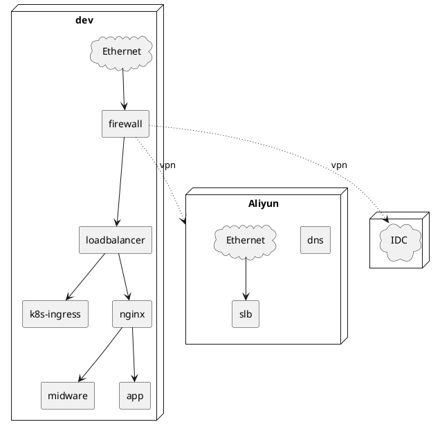

# 网络架构图

```plantuml

@startuml


node Aliyun {
	cloud  Aliyun_Eth as "Ethernet" {

	}

	rectangle  slb

	rectangle  dns

}


node  {
	cloud IDC {

	}

}


node dev {
	cloud Ethernet{

	}

	rectangle  firewall {


	}

	rectangle  loadbalancer {


	}


	rectangle  k8s as "k8s-ingress" {

	}


	rectangle  nginx {

	}


	rectangle  midware {


	}

	rectangle  app {


	}

}
Ethernet --> firewall
firewall --> loadbalancer
firewall -[dotted]-> Aliyun :vpn
firewall -[dotted]-> IDC :vpn

loadbalancer --> k8s
loadbalancer --> nginx

nginx --> app

nginx --> midware


Aliyun_Eth --> slb
@enduml

```

> loadbancer 设备 可以是lvs , f5 , nginx  
> loadbancer 统一管理证书,域名  
> dev 环境使用vyos 虚拟防火墙
