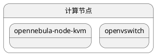
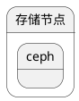

#  opennebula kvm  ovs  ceph部署图

```plantuml
@startuml
state 控制节点{

  state  mysql
  state  sunstone

  state  openvswitch

}


rectangle "事件系统" <<Concept>> {
rectangle "Example 1" <<Concept>> as ex1
rectangle "Another rectangle"
}


@enduml
```





