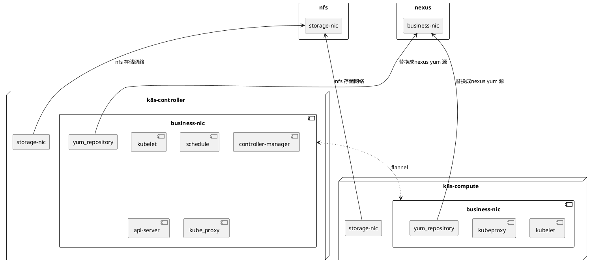

# centos7 私有化部署k8s

## 架构图

```plantuml
@startuml


rectangle nexus {

 rectangle NIC7  as "business-nic"

}


rectangle nfs {
 rectangle NIC8  as "storage-nic"


}

node "k8s-controller" {
 
 rectangle NIC3  as "storage-nic"

 component NIC2  as "business-nic"  {
 	component  kubelet 
 	component  schedule
  	component  controller_manager as "controller-manager" 
 	component  api_server as "api-server"
 	component  kube_proxy as "kube_proxy"
 	rectangle yum_k8s_controller  as "yum_repository"

 }
}


node "k8s-compute" {

 rectangle NIC5  as "storage-nic"
 
 component  NIC4  as "business-nic" {

 	component compute_kubelet as "kubelet"
 	component compute_kubeproxy as  "kubeproxy"
	rectangle yum_k8s_compute  as "yum_repository"

 }

}


NIC7 <--- yum_k8s_controller :替换成nexus yum 源  
NIC7 <--- yum_k8s_compute  :替换成nexus yum 源

NIC8 <--- NIC3 :nfs 存储网络 
NIC8 <--- NIC5 :nfs 存储网络 

NIC2 <-[dotted]-> NIC4 :flannel  


@enduml

```

> [!WARNING]
> - 交付需要先在本地环境测试一下，拉取yum 包
> - 需要执行yum update

## 流程图